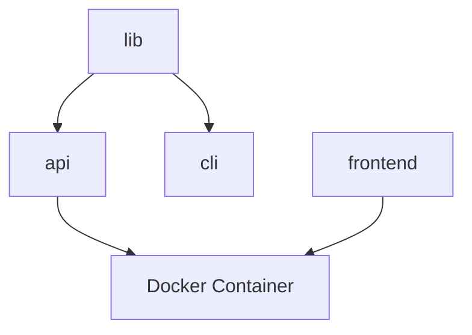

# Dagger Monorepo Dependency Crawler

This library tries to build a [Dagger](http://dagger.io) directory structure containing only the parts of your monorepo you need to build a specific package. It's easiest to illustrate by example:

## The problem

Dockerfiles are conventionally structured to include the minimum set of files needed at the time a given operation is run, to make better use of layer cache. For instance:

```Dockerfile
FROM ubuntu:latest

RUN apt update && apt install curl

COPY go.mod go.sum /src
WORKDIR /src

RUN go mod download

COPY . /src
RUN go build
```

This Dockerfile ensures that the apt installation won't rerun unless we change its command, and the Go dependency installation step won't re-run when we haven't changed the dependencies in the manifest.

Monorepos complicate this picture. Let's consider the sample monorepo in this repository, which contains:

- a hello world library written in Go
- an HTTP API wrapping that hello world library (also written in Go)
- a CLI wrapping that hello world library (again, in Go)
- a React frontend for interacting with the API
- a build for a Docker container that serves the frontend alongside the API



We want to preserve the behavior that we had in the simple Dockerfile above: **when a package's source changes, but not its dependencies, that package should rebuild against the previously-constructed dependency layer**. Concretely:

- A change to lib should rebuild lib, api, cli, and the Docker container, but not frontend
- A change to cli should rebuild only cli
- A change to frontend should rebuild frontend and the Docker container, but not lib, api, or cli

and so on.

For the Docker container, whose build is written purely in Dagger, this is easy to accomplish: if the api `File` and frontend `Directory` don't change, the docker container will be restored from cache. But at the level of Go packages, we have to manually construct the filesystems we want for the moment before we run `go mod download`. For `lib`, it's:

```
/
  projects
    lib
      go.mod
      go.sum
```

For `api`, you want:

```
/
  projects
    api
      go.mod
      go.sum
    lib
      *
```

And for `cli`, you should have:

```
/
  projects
    cli
      go.mod
      go.sum
    lib
      *
```

Frustratingly, `cli` _won't_ build correctly with

```
/
  projects
    cli
      go.mod
      go.sum
      lib
        *
```

Though it's intuitive to see `projects/cli` as the "root" of the package being built, the tooling expects dependencies to be found outside that root directory: whatever content we pull in from the monorepo must preserve the monorepo's structure.

### Haven't we done this before?

It would be very convenient if there were some machine-readable way to understand `cli` and `api`'s relationships to `lib`. And, of course, there is: the dependencies and the path structure are already encoded in the `go.mod` files' `replace` directives:

```
// projects/api/go.mod
module github.com/davidwallacejackson/dagger-monorepo-dep-crawler/api

go 1.18

replace github.com/davidwallacejackson/dagger-monorepo-dep-crawler/lib => ../lib

require (
	github.com/davidwallacejackson/dagger-monorepo-dep-crawler/lib v0.0.0
  ...
)
```

Examining these files makes finding the right set of directories trivial -- just recurse downward from whatever you're trying to build. You can even cross language barriers (this library implements `go.mod` and `package.json` resolution strategies, and it's easy to add more for other languages) or include out-of-band dependencies that your language tooling doesn't know about (just add a `.depends-on` file at the root of your package with a list of relative paths).

## Running the example monorepo project

From the project root, run `mage -d build/magefiles -w .` to get the list of targets:

```
Targets:
  apiDev
  cli
  dockerContainer
  frontend
```

(`lib` does not currently have its own build step)

Build outputs are stored in `dist`. To run the docker container, do

```
mage -d build/magefiles -w . dockerContainer
docker load < dist/container.tgz # copy the image ID beginning with `sha:`
docker run -p 8080:8080 <image_id>
```

You can observe the caching properties of the library by making a change in any package -- if you change `cli`, for instance, and rebuild `dockerContainer`, you'll see that everything is cached, and no work is performed beyond loading the files into Dagger and reading their dependency structure.
